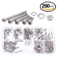
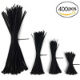
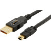
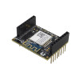

# Donkey Self-Driving Car

This instructable shows off how to create a [DIY Robocar](https://diyrobocars.com/) forked off of the ["Donkey"](http://www.donkeycar.com/) Self-Driving car platform using the OpenMV Cam instead of the RaspberryPi. You can see the car in action in this video [here](https://youtu.be/Pm88BEz3upM).

## Parts

The OpenMV Cam Donkey Car is designed to be easy to build out of parts that you can buy online and assemble together with basic tools. Below is the list of essential parts you'll need to build the self-driving car.

Part Description | Part Link | Part Count | Part Cost
---------------- | --------- | ---------- | ---------
1/16 2.4Ghz Exceed RC Magnet Car  | https://www.amazon.com/2-4Ghz-Exceed-RC-Magnet-Electric/dp/9269803775 | 1 | $79.95
Magenet Car Base Plate  | https://www.shapeways.com/product/6YD3XR9ND/magnet-car-base-plate  You can download the STL file for this part [here](https://www.shapeways.com/product/download/6YD3XR9ND).  *Magnet Base Plate by Adam Conway*. | 1 | $55.10
Magnet Car Roll Cage  | https://www.shapeways.com/product/74VXFV7AT/magnet-car-roll-cage  You can download the STL file for this part [here](https://www.shapeways.com/product/download/74VXFV7AT).  *Magnet Car Roll Cage by Adam Conway*. | 1 | $66.92
OpenMV Cam Donkey Mount  | https://www.shapeways.com/product/G7YQBUMRC/openmv-cam-donkey-mount  You can download the STL file for this part [here](https://www.shapeways.com/product/download/G7YQBUMRC).  *OpenMV Cam Donkey Mount by Chris Anderson*. | 1 | $21.18
M2 Machine Screw Set  | https://www.amazon.com/Glarks-280-Pieces-Phillips-Stainless-Assortment/dp/B01G0KRGXC | 1 | $11.89
M3 35mm Machine Screws  | https://www.amazon.com/M3-3mm-0-50-Stainless-MonsterBolts/dp/B016YZTEB0 | 1 | $4.00
M3 Machine Screw Nuts  | https://www.amazon.com/M3-0-5-3mm-Metric-Stainless-MonsterBolts/dp/B01528BPIU | 1 | $3.49
30 CM Servo Lead Extension Assemblies  | http://hobbyking.com/en_us/30cm-servo-lead-extention-jr-with-hook-26awg-5pcs-bag-1.html | 1 | $1.39
OpenMV Cam M7  | https://openmv.io/products/openmv-cam-m7  Note: You will need a soldering iron and solder to attach the pin headers for this part. | 1 | $65.00
OpenMV Cam Servo Shield  | https://openmv.io/products/servo-shield  Note: You will need a soldering iron and solder to attach the pin headers for this part. | 1 | $15.00
Zip Ties  | https://www.amazon.com/Cable-Zip-Ties-Fastening-Organization/dp/B01LPOB2JW | 1 | $9.99
Micro USB Cable  | https://www.amazon.com/AmazonBasics-USB-Male-Micro-Cable/dp/B01EK87T9M | 1 | $5.99

**Sub-Total $339.90** - However, if you can 3D print parts it's significantly cheaper to build the robocar. You may also have some of the above parts lying around (like the Micro USB cable).

While the above parts list is all you need you may wish to instead control your robocar's servos using the below parts for an arduino based servo controller board which will allow you to control your robot remotely using the RC transmitter that comes with the magnet car. You don't need the servo shield above if you build your car using the below components.

Part Description | Part Link | Part Count | Part Cost
---------------- | --------- | ---------- | ---------
5V 16 MHz Arduino Pro Mini  | https://www.amazon.com/Arducam-Atmega328-Development-Compatible-Arduino/dp/B01981EBBA | 1 | $6.49
Arduino Pro Mini Programmer  | https://www.amazon.com/Micro-Basic-Breakout-Module-Arduino/dp/B00N4MCS1A | 1 | $9.95
Servo Controller Board  | https://oshpark.com/shared_projects/2bKUWmbq  You can download the Gerber files for this part [here](https://644db4de3505c40a0444-327723bce298e3ff5813fb42baeefbaa.ssl.cf1.rackcdn.com/ab7a7db45c3c6b37bcca1d8fc84e26e4.zip).  *Servo Controller Board by Chris Anderson*. | 1 | $10.50 
Male Headers  | https://www.amazon.com/SamIdea-15-Pack-Straight-Connector-Prototype/dp/B01M9FCAXW  Note: You will need a soldering iron and solder to attach these pin headers to the above PCB. | 1 | $5.69
8-pin Stackable Headers  | https://www.amazon.com/Venel-Electronic-Component-Stackable-Shields/dp/B071454KP1  Note: You will need a soldering iron and solder to attach these pin headers to the above PCB. | 1 | $5.08
RC Receiver Servo Adapters  | https://www.amazon.com/Hobbypower-Futaba-Servo-Extension-Cable/dp/B00RVDVWTC | 1 | $4.49
Mini USB Cable  | https://www.amazon.com/AmazonBasics-USB-2-0-Cable-Male/dp/B00NH11N5A | 1 | $5.49

**Sub-Total $47.69** - You may have some of the above parts lying around (like the Mini USB cable).

In addition to all of the above I **heavily** recommend that your purchase a wide angle lens for your OpenMV Cam. With the wide angle lens it's much easier for your self-driving car to make tight turns and not loose sight of the road ahead. Without it you *will* have to reduce your maximum speed in-order to make tight turns.

Part Description | Part Link | Part Count | Part Cost
---------------- | --------- | ---------- | ---------
OpenMV Cam Wide Angle Lens  | https://openmv.io/products/ultra-wide-angle-lens | 1 | $15.00

**Sub-Total $15.00**

Moving on, for better performance I recommend that you purchase LiPo batteries, adapters, and a LiPo charger. The NiMh battery that comes with the Magnet Car will quickly run out of power making it hard for you to test for hours before a race on the same day.

Part Description | Part Link | Part Count | Part Cost
---------------- | --------- | ---------- | ---------
Turnigy 1300mAh 2S 20C LiPo Pack  | http://hobbyking.com/en_us/turnigy-1300mah-2s-20c-lipo-pack-suit-1-18th-truck.html | 3 | $10.03
Tamiya Mini Female to XT60 Male Adapters  | http://hobbyking.com/en_us/female-mini-tamiya-gt-male-xt60-3pcs-bag.html | 1 | $3.36
Turnigy E3 Compact 2S/3S Lipo Charger  | http://hobbyking.com/en_us/turnigy-e3-compact-2s-3s-lipo-charger-100-240v-us-plug.html | 1 | $12.35

**Sub-Total $45.77**

Finally, for wireless programming I recommend that you purchase a WiFi shield for the OpenMV Cam. With the WiFi shield you'll be able to comfortably test your self-driving car from one position versus having to follow your car around tethered by a USB cable.

Part Description | Part Link | Part Count | Part Cost
---------------- | --------- | ---------- | ---------
OpenMV Cam WiFi Shield  | https://openmv.io/products/wifi-shield | 1 | $35.00

*Note, as of 8/15/2017 wireless programming has not yet been implemented for the OpenMV Cam but it is comming soon.*

**Sub-Total $35.00**

## Assembly

Once you've purchased and recieved all the parts you want for your DIY Robocar above you can now build it. Note that you're going to need an exacto knife, a philips screw driver, pliers, a soldering iron, and some solder.

### Step 1 - Clean up parts:

Your 3D printed parts are most-likely going to need some cleanup. Using the extaco knife remove any burs on the 3D printed parts and cleanout any excess material in any of the holes in the 3D printed parts. In particular, you're going to want to make sure to clear out material left over in the slots on the sides of the roll bar.

Next, try to insert the 3D printed OpenMV Cam mount neck part into it's holder. The parts are designed to fit snuggly so this takes a bit of work. If you're having trouble try widening the neck holder with a file. Since we want the most height for the camera you just need to get the neck mount in enough to line up the first set of holes.

### Step 2 - Assemble the body:

The rollbar mounts to the base plate using three M2 screws and nuts - a pair for each leg on the rollbar. Additionally, feel free to use any M2 screw length that fits. Moving on, before mounting the rollbar to the base plate make sure the screw stands on the base plate are facing up. The screw stands are for a Raspberry Pi and a servo controller which we won't be using, but, the screw holes shouldn't be upside down if you want to mount something else there later on. To attach the rollbar to the base plate you need to insert a nut into the slots on either side of the front two rollbar legs (note that the screws are inserted from the bottom of the base plate). You then have to keep the nuts in place while screwing in the M2 screws. Doing this isn't particularly easy but doesn't require more that two hands. You may wish to use a tool to keep the nuts from spinning in their slots. After you've attached both of the front legs to the base plate you can then attach the third back leg. This should be rather easy as you can just press down on the nut from the top to keep it from spinning as you tighten the M2 screw from the bottom.

Next, attach the OpenMV Cam neck holder mount to the top of the rollbar using four more medium-length M2 screws. Note that this will take some work since the screw holes are unlikely to lign-up exactly. However, you should be able to get the screws all in. Next, insert one of the long M3 screws in between the neck holder and the neck part's bottom hole. Use an M3 locknut afterwards to tighten the connection to make sure the neck part is stable. Now, attach the the OpenMV Cam holder to the top of the neck part and use another long M3 screw and locknut secure the holder in place.

Finally, remove the plastic hood from your RC car. The hood is held on by four metal pin clips. Mount the base plate onto the four stands exposed after you removed the plastic hood from your RC car. The base plate should snuggly sit on the four mounting posts.

Next, you need to make sure the base is firmly attached to the RC Car. First, bend the four metal clips slightly so we can more easily get them through the holes in the mounting stands. Next, cut away material using your exacto knife from the groves in the base to make space for the metal pins to go through the stand holes. Finally, push each pin through each stand hole to firmly attach the base to the RC Car. Once you've finished this your car should look like this below.

### Step 3 - Assemble the head:

Now we're going to attach the OpenMV Cam to the body. First, remove the lens mount from your OpenMV Cam using a screw driver and clean off the camera IC under the lens mount using some isopropyl alchol and a microfiber cloth. Make sure to get off any dirt and don't leave any fibers on the camera IC. Then reattach the lens mount. Next, we need to solder the pin headers onto the OpenMV Cam that it comes with. Using a soldering iron attach the two 8-pin headers on each side of the camera so that the 8-pin header legs are sticking out the back of the OpenMV Cam. Finally, if you bought the wide angle lens above replace the lens that your OpenMV Cam comes with with the wide angle lens.

Next, let's build up the servo shield for your OpenMV Cam so that it can control the RC car. You need to solder on the two 8-pin headers on either side of the servo controller board with the pin legs facing down. Then, solder on the two servo connection headers. The plastic parts on each header should be vertical and not flat against the servo controller board.

If you bought a WiFi shield let's build that up too. Solder the two 8-pin headers it came with on either side of it with the legs facing down.

Finally, let's stack everything up. You can mount shields on the OpenMV Cam from either the top or bottom of the board. Let's put the WiFi shield on the top of the OpenMV Cam and the servo shield on the bottom. However, let's use some of those extra 8-pin headers we have to space out the servo shield from the OpenMV Cam so we have more space to mount it to the body. So, insert an extra 8-pin header on each side of the OpenMV Cam between the OpenMV Cam and the servo shield connection.

### Step 4 - Putting it together:

Attach the OpenMV Cam using it's two screw mounting holes to the OpenMV Cam mount on the top of the robocar body. To give yourself more freedom mount the OpenMV Cam upside down. You'll be able to rotate the OpenMV Cam's field of view in software.

Next, using the servo extension header attach channels 0 and 1 from the servo shield to the throttle and steering servo wires respectively. Make sure to thread the servo extension wires through the hole in the base plate.

Now, let's tiddy everything up. Use the zip ties to tie down all your wires so they aren't swaying everywhere. You don't want your robocar accidentally destroying itself by running over one of its wires.

Finally, if you bought the battery upgrade option remove the NiMh battery from your robocar and install the lipo battery with the XT60 to Tamiya adapter.

### Step 5 - Installing the software:

Because you're using the OpenMV Cam this is going to be the easiest part. Download OpenMV IDE from [here](https://openmv.io/pages/download) and install it on your laptop. Once that's done attach the micro usb cable to your OpenMV Cam and to your laptop. Next, launch OpenMV IDE and hit the connect button the bottom left hand corner of the IDE. After doing so OpenMV IDE should display on the bottom right hand corner that your OpenMV Cam's firmware is out of date. Click on the text and walk through the dialog to update your OpenMV Cam's firmware. When OpenMV IDE asks you if you want to erase the OpenMV Cam's flash drive select yes. After doing all of this download the code for the robocar [here](https://github.com/openmv/openmv-projects/blob/master/donkey-car/main.py) and open the script in OpenMV IDE. How the script works is documented in the comments.

Finally, the run the script click the run button on OpenMV IDE in the lower left-hand corner and your robocar should come to life! Once you're done tweaking settings go to ``Tools->Save open script to OpenMV Cam`` and save the script while keeping comments. Then ``Tools->Reset OpenMV Cam``. You can now disconnect your OpenMV Cam from your laptop and it will run the script by itself. Follow the above two steps each time you want your OpenMV Cam to run the script without the laptop attached to it. For quick testing and debug while your laptop is connected just use the run button and stop button.

### Optional Step 1 - Building the Arduino based Servo Controller:

If you opted to get the Arduino based Servo Controller so you can use your RC controller to act as a kill switch for your robocar (which is a good idea) here's how to build it.

First, solder two 8-pin female headers onto either side of the servo controller board. Note that since we want this servo controller to mount onto the back of the OpenMV Cam we're going to do this in reverse. The female side of these headers should be on the side of the PCB that says ``123D Circuits``. Next, on the Arduino Pro Mini solder male pin headers facing down on either side of it. As for the row of pin headers that go across it on it's back solder male pin headers there facing up. Finally, solder the Arduino Pro Mini to the servo controller board such that the button on it is over the row of holes going across the bottom of the servo controller board.

Now, install male pin headers facing up on the servo controller board in all the available remaining holes not covered by the Arduino Pro Mini. The only holes that should have anything in them are the eight holes going across the bottom of the servo controller board under the Arduino Pro Mini.

Finally mount the Arduino based Servo Controller board to the back of your OpenMV Cam. You'll want to use two of the extra 8-pin female headers to act as spacers between the OpenMV Cam and the servo controller board. Note that the servo controller board should mount such that it's not sticking out of the OpenMV Cam's form factor.

### Optional Step 2 - Programming the Arduino based Servo Controller:

Connect the USB to serial adapter to the 6-pin header sticking out of the top on your Arduino Pro Mini. Make sure to connect ``GND`` to ``GND`` and ``DTR`` to ``DTR``. Next, connect the mini usb cable to the USB converter and your laptop. Install the Arduino IDE from [here](https://www.arduino.cc/en/Main/Software). Download the servo controller code from [here](https://github.com/openmv/openmv-projects/blob/master/donkey-car/servo_controller/servo_controller.ino) and open it using the Arduino IDE. Go to ``Tools->Board`` and select ``Arduino Pro or Arduino Pro Mini`` and ``Tools->Processor`` and select ``Atmega328 (5V, 16Mhz)`` . Finally, go to ``Tools->Port`` and select the COM port your USB to serial convert is connected to (it's usally the highest numbered COM port) and then click the upload button (round left arrow). The Arduino IDE should then compile the code and start programming the Arduino Pro Mini. Once it's finished remove the USB to serial converter from your Arduino Pro Mini and your servo controller board will be ready to use.

## How does the robocar follow the line?

The OpenMV Cam uses linear regression to detect where the line is and then follow it. With the the OpenMV Cam the machine vision part is simple. Most of the work the script the OpenMV Cam is running has to do with turning the line detection into servo outputs to control the robocar. You can read more about what's going on at the blog post [here](https://openmv.io/blogs/news/linear-regression-line-following).
